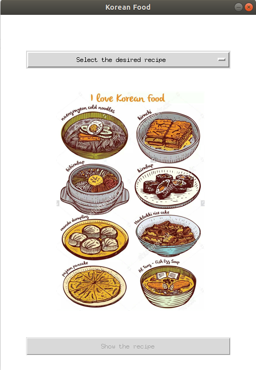

# A simple python Project to learn the tkinter GUI
From 3 different Korean dishes you can select one and see its recipe
Tkinter is easy to use but the resaults are not as customizable as with Swing from Java.

## How to use the code
There is no requirements to run this project. Just make a env with python 3 and run the main.py.
